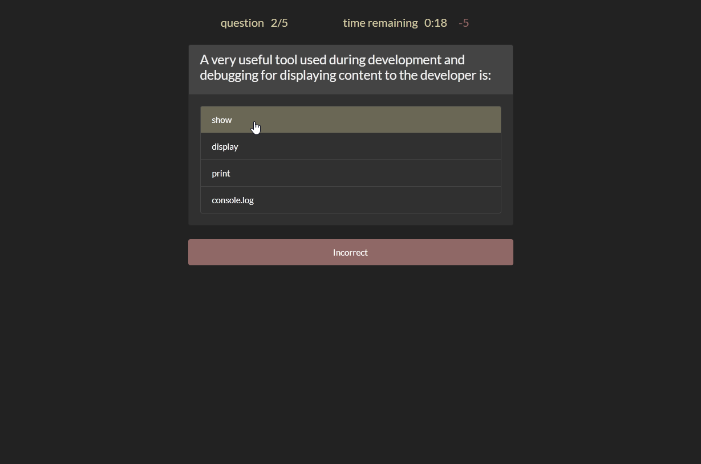

# **JavaScript Code Quiz**

&nbsp;
## **Description**
JavaScript Code Quiz serves up a timed knowledge assessment on JavaScript coding fundamentals. A user's quiz score is based on the number of questions they get correct and the time remaining upon their completion. 

JavaScript code quiz is themed using the [free bootstrap theme darkly](https://bootswatch.com/darkly/) with some additional custom CSS styling. The site's dark color theme is accented using [official JavaScript yellow](https://github.com/colorjs/javascript-yellow#:~:text=javascript-yellow%20The%20official%20color,of%20the%20JavaScript%20logo).

&nbsp;
## **[Live Application](https://spfave.github.io/javascript-code-quiz/)**

Demo interaction \

&nbsp;
## **Technologies and Services**
Web Technologies
- HTML5, CSS, and JavaScript
- Local and Session Storage
- Array sort method

External Services
- [Bootstrap](https://getbootstrap.com/) v4.6 for styling elements
- [Bootswatch Darkly Theme](https://bootswatch.com/darkly/) bootstrap theme
- [flaticon](https://www.flaticon.com/) vector icons (favicon)